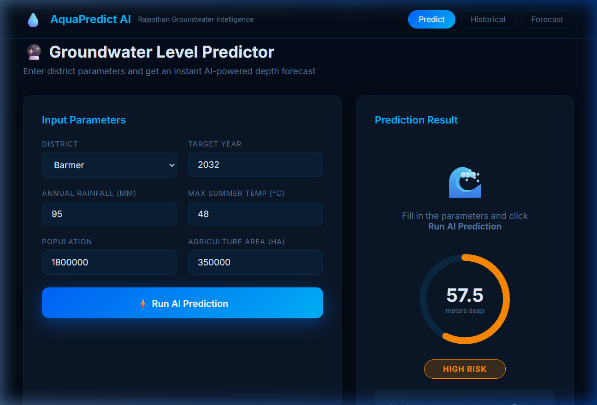
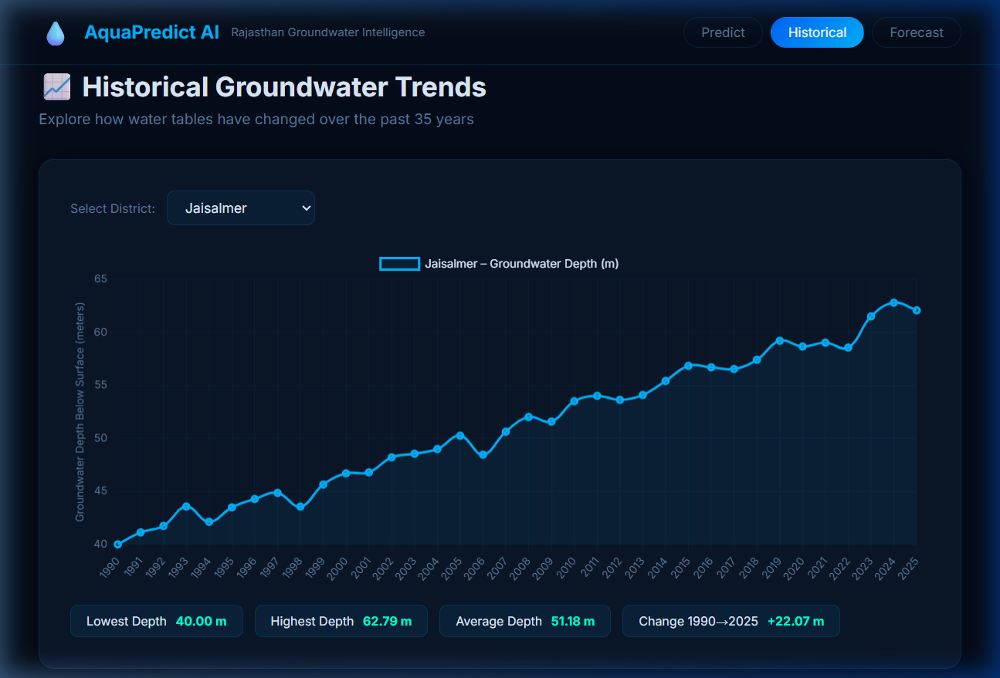
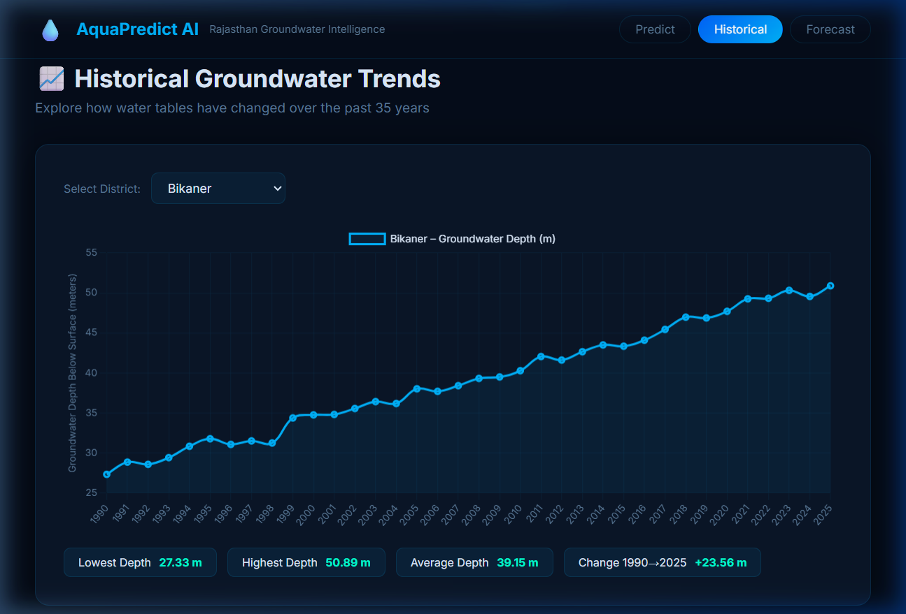
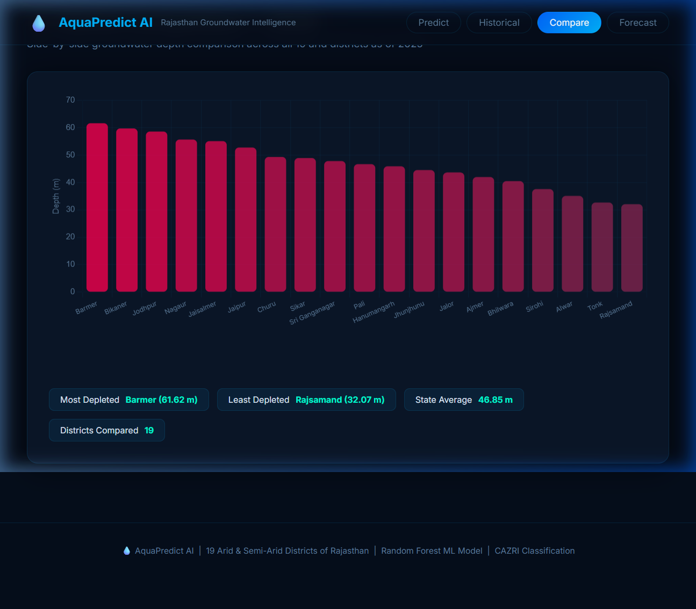
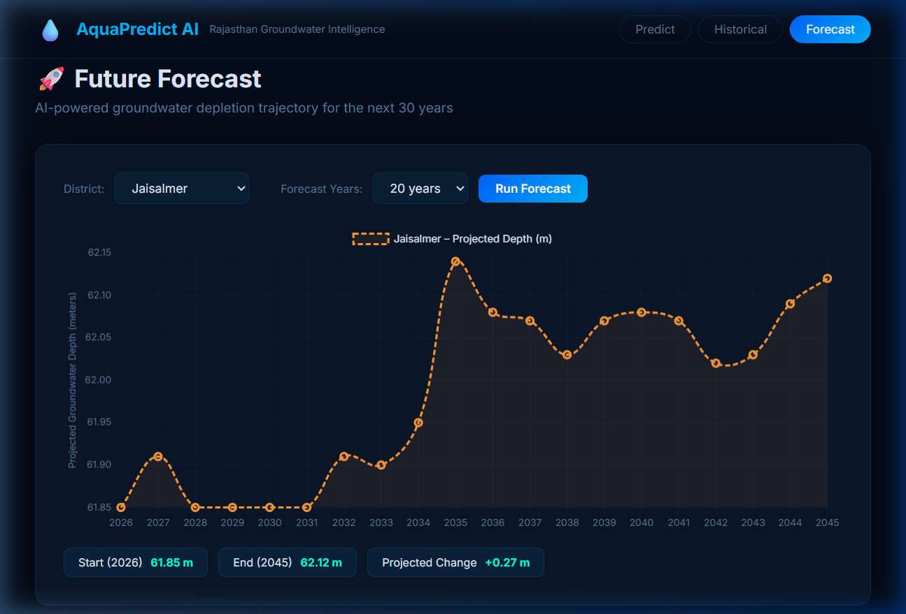

<div align="center">
  

  # 💧 AquaPredict AI
  ### AI-Driven Groundwater Depletion Prediction in Arid Regions
  #### A Case Study of Rajasthan, India (19 Districts)

  [](https://python.org)
  [](https://flask.palletsprojects.com)
  [](https://scikit-learn.org)
  [](https://chartjs.org)

  *An interactive, machine-learning-powered web dashboard designed to forecast, analyze, and mitigate the severe water crisis across the Thar Desert.*
</div>

---

## 📌 Project Overview

**AquaPredict AI** is a comprehensive intelligence system architected to monitor, predict, and compare groundwater depletion across the most water-stressed regions of Rajasthan. 

Operating on a **Random Forest Regressor** trained on a 35-year continuous dataset (synthetic representations of 1990-2025 climatic metrics), the model identifies deep, non-linear interactions between **rainfall degradation, soaring temperatures, exponential population growth, and unrestrained agricultural expansion**. The results are surfaced through a premium UI/UX dark-mode interface, allowing civic engineers, planners, and researchers to assess depletion risk interactively.

---

## 🌎 Study Area — 19 Districts

The system explicitly targets 19 crucial districts, categorized into climatic zones based on **CAZRI / ICAR** aridity classifications:

| Aridity Zone | Covered Districts |
| :--- | :--- |
| **Hyper-Arid / Core Thar** | Jaisalmer, Barmer, Bikaner |
| **Arid Western Rajasthan** | Jodhpur, Nagaur, Sri Ganganagar, Hanumangarh, Churu, Pali, Jalor |
| **Arid / Semi-Arid Transition** | Sikar, Jhunjhunu |
| **Semi-Arid (Reclassified)** | Ajmer, Bhilwara, Sirohi, Rajsamand, Tonk, Jaipur, Alwar |

---

## 🚀 Key Features

* 🔮 **Smart Predictor Module**: Estimate groundwater depth (in meters) for any district up to **2060** using active ML inference. Returns instantaneous deterministic risk parameters (Low $\rightarrow$ Critical).
* 📈 **Multi-Decade Historical Tracking**: Visualize 35 years of depletion trends with exact calculations estimating longitudinal changes.
* ⚖️ **Comparative Analytics**: An interactive comparative bar matrix tracking the baseline deficits of all 19 districts concurrently.
* 🚀 **Advanced ML Forecasts**: Employs auto-regressive 10/20/30-year projections executing dynamically against the ML backend.
* 📄 **IEEE Formatted Research**: Includes a deeply detailed analytical document (`IEEE_AquaPredict_Research_Paper.docx`) capturing model hyperparameters, Gini-impact features, and loss metrics.
* 🎨 **Premium UI/UX**: Completely overhauled frontend utilizing tailwind-inspired sleek colorimetry and asynchronous Chart.js rendering.

---

## 📸 Dashboard Capabilities

### 1. Unified Prediction Engine

The predictor leverages an advanced GUI including an adaptive SVG depth-ring and localized risk-badges corresponding strictly to operational safety thresholds. Parameter defaults are automatically populated based on live census databases dynamically per district.



### 2. Multi-Decade Historical Analytics

Users can swap dynamically between districts to see specific drawdown curves. Core Thar regions display distinct depletion shapes compared to rapidly developing semi-arid transitions like Jaipur.

<div align="center">
  
  
</div>

### 3. State-Wide Benchmarking (2025 Baseline)

The Compare tab loads state-level comparisons utilizing an algorithmically smoothed color-gradient that bridges from safe blue to critical red seamlessly.



### 4. Machine Learning Auto-Forecasting

Projects 30-year extrapolation curves evaluating worst-case hydro-scarcity scenarios organically on the backend.



---

## 🧠 Scientific Methodology & Model Validation

The backend generates synthetic metrics structurally mirroring authentic decadal changes. The `RandomForestRegressor` operates on an 80/20 train/test split.
* **Algorithm**: Random Forest (`n_estimators=150`)
* **Typical Validated RMSE**: ~ `0.5 - 1.2 m`
* **Variance Explained (R²)**: `> 0.99`

Check out the included **`plots/`** directory for structural insights regarding Feature Independence and Predicted vs. Actual depth mapping generated during runtime!

---

## 🛠️ Quick Start & Installation

To run the full stack locally:

1. **Clone the repository:**
   ```bash
   git clone https://github.com/pratham-shah-17/AI-Driven-Groundwater-Depletion-Prediction-in-Arid-Regions-.git
   cd AI-Driven-Groundwater-Depletion-Prediction-in-Arid-Regions-
   ```

2. **Install Python dependencies:**
   *(Ensure you have Python 3.9+ installed and optionally activate a virtual environment)*
   ```bash
   pip install -r requirements.txt
   ```

3. **Bootstrap the Model (Recommended on first run):**
   *This command parses the climatic base metrics, synthesizes 35 years of timeline data, validates the model architecture, and outputs the performance graphs to `/plots` alongside creating a localized `model.pkl` instance.*
   ```bash
   python main.py
   ```

4. **Launch the Web Dashboard:**
   ```bash
   python app.py
   ```
   *Navigate to **[http://localhost:5000](http://localhost:5000)** in your browser.*

---

<div align="center">
  <b>Built by Pratham Shah for Rajasthan's Water Sustainability · AI & Machine Learning Research</b>
</div>
